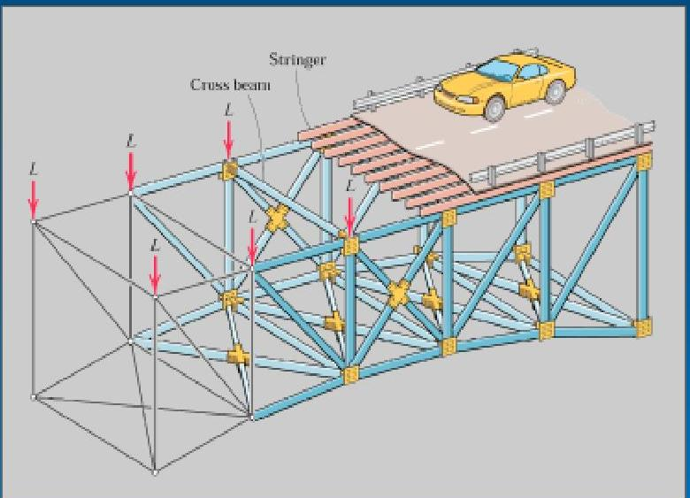
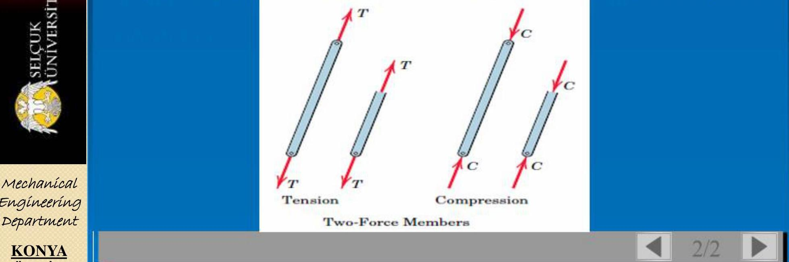
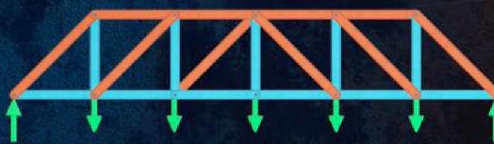
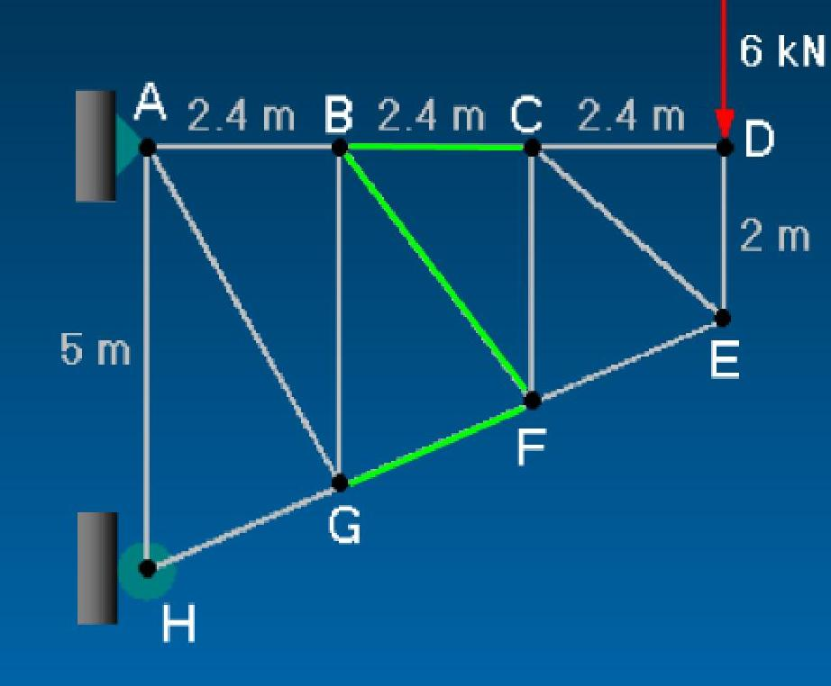
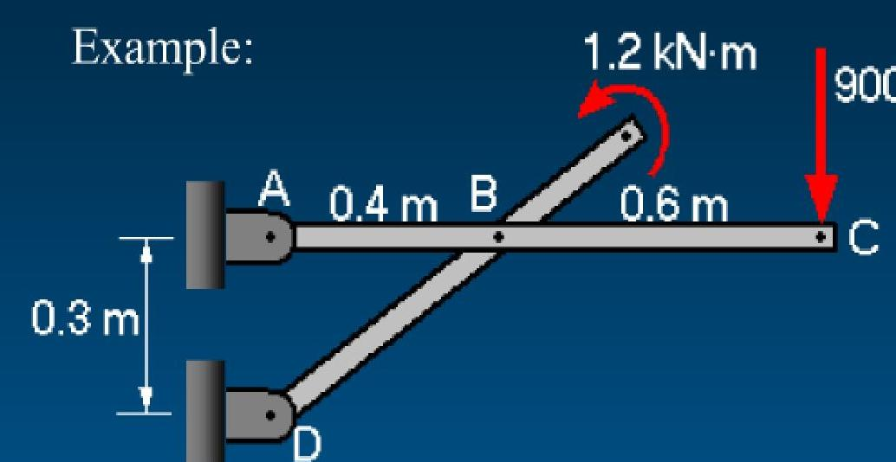

# İçindekiler

- [Genel Özet](#genel-özet)
- [Temel Terimler ve Kavramlar](#temel-terimler-ve-kavramlar)
- [Ana Gövde: Kronolojik veya Tematik Kayıt](#ana-gövde-kronolojik-veya-tematik-kayıt)
  - [Yapılar – Giriş](#yapılar--giriş)
  - [Düzlem Kafesler](#düzlem-kafesler)
    - [Düğüm Noktaları Yöntemi (Method of Joints)](#düğüm-noktaları-yöntemi-method-of-joints)
    - [Kesitler Yöntemi (Method of Sections)](#kesitler-yöntemi-method-of-sections)
  - [Çerçeveler ve Makineler](#çerçeveler-ve-makineler)
- [Temel Formüller ve Hızlı Bilgiler](#temel-formüller-ve-hızlı-bilgiler)
- [Kaynaklar](#kaynaklar)

---

# Genel Özet

Bu bölümde **Mühendislik Mekaniği** dersinin “**Yapılar**” konusu ayrıntılı olarak işlenmiştir. Daha önce cisimler üzerine etki eden *dış kuvvetler* incelenmişti; şimdi ise *iç kuvvetler*, yani yapı elemanlarının taşıdığı yükler analiz edilmektedir. Bu analiz, kafes sistemleri (*trusses*), çerçeveler (*frames*) ve makineler (*machines*) üzerinde yapılmaktadır.  

**Düzlem kafesler**, uçlarından birleştirilmiş iki kuvvetli elemanlardan oluşan rijit yapılardır. Bu kafeslerde kuvvet hesabı için iki temel yöntem sunulmuştur:  
- **Düğüm Noktaları Yöntemi**, her düğümde denge denklemleri çözülerek kuvvetlerin adım adım belirlenmesini sağlar.  
- **Kesitler Yöntemi**, istenilen elemanlardan geçen bir kesit ile truss’un bir parçası izole edilip, rijit cisim dengesi denklemleri uygulanarak doğrudan çözüm sağlar.  

Ayrıca **çerçeveler ve makineler**, çok parçalı sistemlerdir ve iç kuvvetler Newton’un Üçüncü Yasası aracılığıyla elemanlar arasında iletilir. Analiz için sistem parçalara ayrılmalı ve her parça için ayrı ayrı serbest cisim diyagramları çizilmelidir.

Bu bölüm, truss türlerini (Howe, Pratt, Warren), sıfır kuvvetli elemanları, basit ve karmaşık sistem analiz tekniklerini ve örnek problemlerle uygulamalı çözümleri içermektedir.

---

# Temel Terimler ve Kavramlar

**Düzlem Kafes**: Tüm elemanları tek bir düzlemde bulunan ve uçlarından mafsallı olarak birleştirilmiş rijit çatı sistemi.  
**İki Kuvvetli Eleman**: Sadece iki ucundan kuvvet alarak dengede olan eleman; kuvvetler eşit, zıt ve aynı doğrultudadır.  
**Düğüm Noktası Yöntemi**: Truss analizinde her düğüm noktasına ayrı ayrı uygulanan denge denklemleriyle eleman kuvvetlerinin hesaplandığı yöntem.  
**Kesitler Yöntemi**: Truss’tan üç veya daha az eleman kesilerek, izole edilen kısmın rijit cisim dengesiyle kuvvetlerin doğrudan hesaplandığı yöntem.  
**Sıfır Kuvvetli Eleman**: Belirli geometrik ve yükleme koşullarında kuvvet taşımayan truss elemanı; tasarım optimizasyonunda önemlidir.  
**Çerçeve**: Rijit olmayan, dış yükler altında şekil değiştirebilen çok parçalı yapı; dengesi için parçalara ayrılması gerekir.  
**Pratt Kafesi**: Diyagonal elemanların genellikle çekmeye, düşey elemanların basmaya çalıştığı, ekonomik bir köprü kafesi türü.  

---

# Ana Gövde: Kronolojik veya Tematik Kayıt

## Yapılar – Giriş

Yapılar bölümü, mühendislik mekaniğinde statik analizin bir adım ilerisini temsil eder. Artık yalnızca bir cismin üzerine etki eden dış kuvvetlerle değil, **yapının kendi iç elemanlarının taşıdığı kuvvetlerle** ilgileniyoruz. Bu, tasarım aşamasında her bir elemanın yeterli dayanıma sahip olup olmadığını değerlendirmek için kritik öneme sahiptir.

> [!note]  
> Gerçek köprülerde bağlantılar perçinli ya da kaynaklı olsa da, analizde genellikle **basit mafsallı** olarak kabul edilir. Bu idealizasyon, kuvvet aktarımını basitleştirir.



Görseldeki köprü örneğinde:  
- **L** kuvvetleri, yol yüzeyi, taşıt ağırlığı ve yardımcı kirişlerden düğüm noktalarına iletilen yüklerdir.  
- Her düşey kenar, bağımsız bir **düzlem kafes** olarak modellenmiştir.

---

## Düzlem Kafesler

Bir **kafes**, uçlarından birleştirilmiş doğrusal elemanlardan oluşan rijit bir yapıdır. Tipik örnekler: köprüler, kuleler, çatı sistemleri. Düzlem kafeslerde tüm elemanlar aynı düzlemdedir.

### Temel Kabuller:
1. Tüm elemanlar **iki kuvvetli elemandır** (uçlarından kuvvet alır, kuvvetler doğrusal ve zıttır).  
2. Bağlantılar **mafsallıdır**.  
3. Dış kuvvetler **yalnızca düğüm noktalarında** etki eder.  
4. Elemanlar **çekmeye** (tension) ya da **basmaya** (compression) çalışır.



> [!example]+  
> **Çekme (T):** Eleman uzar, iç kuvvet dışa doğrudur.  
> **Basma (C):** Eleman kısalır, iç kuvvet içe doğrudur.

### Kafes Türleri:

| Tür | Özellikler |
|-----|-----------|
| **Howe** | Düşey elemanlar çekme, diyagonaller basma → maliyetli |
| **Pratt** | Diyagonaller çekme, düşeyler basma → daha ekonomik |
| **Warren** | Eşkenar üçgenler, daha az eleman, diyagonaller sırayla çekme/basma |



---

### Düğüm Noktaları Yöntemi (Method of Joints)

Bu yöntem, truss’un her bir düğüm noktasını ayrı ayrı inceler.

#### Prosedür:
1. Dış reaksiyonlar bulunur (genellikle gereklidir).  
2. **En fazla 2 bilinmeyenli** bir düğüm seçilir.  
3. Her düğüm için **ΣFₓ = 0** ve **ΣFᵧ = 0** uygulanır.  
4. Eleman kuvvetleri ve karakterleri (T/C) kaydedilir.  
5. Son düğüm genellikle kontrol amaçlı kullanılır.

> [!success]  
> **İpucu:** Eğer bir düğümde iki eleman aynı doğru üzerindeyse ve dış yük yoksa, üçüncü eleman **sıfır kuvvetlidir**.

#### Örnek: Basit Truss Analizi


- **A noktasında:**  
  - ΣFₓ = 0 → Aₓ = 3000 lb  
  - ΣFᵧ = 0 → Aᵧ = 1000 lb  
- **D desteği:** Dᵧ = 3000 lb  
- Ardından sırayla B, E, C düğümleri çözülür.

> [!infobox|center]  
> **B düğümü çözümü:**  
> - AB = 1250 lb (T)  
> - BC = 4500 lb (C)  
> - BE = 1250 lb (T)

---

### Kesitler Yöntemi (Method of Sections)

Birden fazla elemanın kuvveti doğrudan hesaplanmak istendiğinde bu yöntem tercih edilir.

#### Prosedür:
1. Dış reaksiyonlar bulunur.  
2. **3 veya daha az** eleman kesilecek şekilde bir kesit geçirilir.  
3. Kesilen kısmın **ΣFₓ = 0, ΣFᵧ = 0, ΣM = 0** denklemleri uygulanır.  
4. Bilinmeyenler çözülür.

> [!note]  
> Moment denklemi, bir bilinmeyeni tek başına bırakmak için çok etkilidir.

#### Örnek: BC, BF, GF Elemanlarının Hesabı



- Kesit bu üç elemandan geçirilir.  
- ΣM_B = 0 → GF = 7.8 kN (C)  
- ΣM_F = 0 → BC = 4.8 kN (T)  
- ΣFᵧ = 0 → BF = 3.84 kN (T)

> [!CODE]- Örnek Hesaplama  
> ```math
> \Sigma M_B = 0: \quad GF \cdot (4) + 6 \cdot (2.4) = 0 \Rightarrow GF = -7.8 \, \text{kN (C)}
> ```

---

## Çerçeveler ve Makineler

Çerçeveler ve makineler, **hareketli parçalar içermeyen (çerçeve)** veya **içeren (makine)** çok parçalı sistemlerdir. Analiz için:

1. Dış reaksiyonlar bulunur (mümkünse).  
2. Sistem **parçalara ayrılır**.  
3. Her parça için **ayrı serbest cisim diyagramı** çizilir.  
4. **Newton’un Üçüncü Yasası** ile iç kuvvetler çiftler halinde gösterilir.  
5. Tüm parçalar için denge denklemleri çözülür.

> [!example]+  
> Toplam bilinmeyen sayısı = Toplam denge denklemi sayısı → Çözülebilir.

#### Örnek: 900 N Yük Altındaki Çerçeve



- **AC elemanı:**  
  - ΣM_A = 0 → B_y = 2250 N  
  - ΣF_y = 0 → A_y = -1350 N  
- **BD elemanı:**  
  - ΣF_y = 0 → D_y = B_y = 2250 N  
  - ΣM_B = 0 → D_x = -1000 N

> [!infobox|center]  
> **Sonuçlar:**  
> - Aₓ = 1000 N, Aᵧ = -1350 N  
> - Bₓ = Dₓ = -1000 N  
> - Bᵧ = Dᵧ = 2250 N

---

# Temel Formüller ve Hızlı Bilgiler

> [!example]+ Düğüm Yöntemi İçin Kurallar
> - **ΣFₓ = 0**, **ΣFᵧ = 0** → her düğümde iki denklem.
> - **Sıfır kuvvetli elemanlar**:
>   - İki elemanlı + yük yok → her ikisi sıfır.
>   - Üç elemanlı, ikisi aynı hizada → üçüncüsü sıfır.

> [!example]+ Kesit Yöntemi İçin Strateji
> - **ΣM = 0** ile bir bilinmeyen tek başına bırakılır.
> - Kesilen eleman sayısı **≤ 3** olmalı (düzlemde 3 denge denklemi vardır).

**Trigonometrik İlişkiler:**
```math
\alpha = \tan^{-1}\left(\frac{dikey}{yatay}\right)
```

**Kuvvet Bileşenleri:**
```math
F_x = F \cos \theta, \quad F_y = F \sin \theta
```

**Moment Hesabı:**
```math
\Sigma M_O = 0 \Rightarrow \sum (\text{kuvvet} \times \text{dik mesafe}) = 0
```

---

# Kaynaklar

Kaynak bulunamadı.