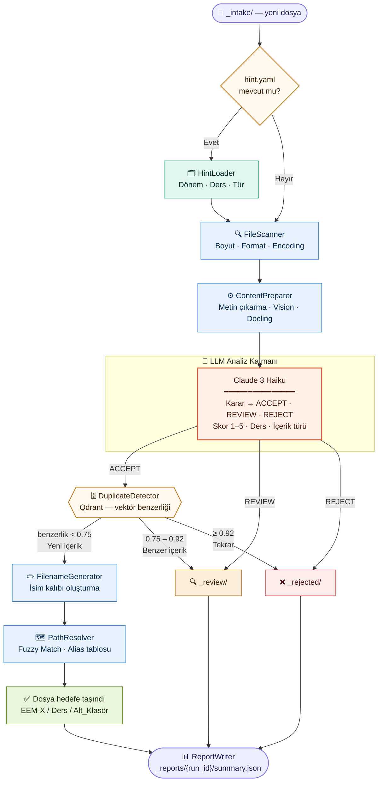

# ktunDepo — KTÜN Ders Materyali Deposu

[](https://opensource.org/licenses/MIT) [](https://www.python.org) 

[**ktünot'un**](https://ktun.not.tr) *omurgası* - KTÜN EEM Ders Kaynak Arşivi - KTÜN AI Agent Sistemi

Bu depo, KTÜN Elektrik-Elektronik Mühendisliği Fakültesi öğrencileri için **merkezi ders materyali deposudur**. Öğrencilerin ders notlarını, sınav sorularını ve diğer materyalleri paylaşmasını sağlayan **LLM-first bir AI agent sistemi** tarafından yönetilmektedir.

---

## 🎯 Özellikler

| Özellik | Açıklama |
|---|---|
| **LLM-First Kalite Kontrolü** | Her dosya `claude-3-haiku` tarafından değerlendirilir; karar 1–5 yıldız skoru ile verilir |
| **Duplicate Tespiti** | Qdrant vektör veritabanı ile semantik benzerlik kontrolü yapılır |
| **Fuzzy Ders Eşleştirme** | Yanlış yazılmış ders adlarını `rapidfuzz` ile doğru klasöre yönlendirir |
| **Otomatik Dosya Adlandırma** | `{tür}_{konu}_{yıl}_{skor}Star_v{n}.{ext}` formatında standart ad üretimi |
| __*OCR Kuyruğu__ | Metin katmanı olmayan taranmış PDF'ler ayrı kuyrukta izlenir |
| __*Docling Entegrasyonu__ | Gelişmiş PDF içerik çıkarımı (sayfa sayısı, tablo, matematiksel formül) |
| __*Telegram Bot__ | Bot üzerinden materyal yükleme ve durum sorgulama |
| **JSON Raporlama** | Her çalıştırma için `_reports/{run_id}/` klasöründe detaylı loglama |

---

## 📁 Depo Yapısı

```
ktunDepo/
├── EEM/                          # Ana materyal deposu
│   ├── EEM-1/                    # 1. Dönem
│   │   ├── fizik/
│   │   ├── lineer-cebir/
│   │   └── ...
│   ├── EEM-2/                    # 2. Dönem
│   │   ├── devre-analizi/
│   │   ├── elektronik/
│   │   │   └── LMS/              # LMS sunumaları için alt klasör
│   │   └── ...
│   └── ...                       # EEM-3 → EEM-8
│
├── agent/                        # AI Agent sistemi
│   ├── config.yaml               # Yapılandırma
│   ├── state.json                # Agent çalışma durumu
│   ├── prompts/                  # LLM promptları
│   ├── logs/                     # Çalışma logları
│   └── intake/                   # Pipeline bileşenleri
│       ├── file_scanner.py       # [1] Teknik tarama
│       ├── content_preparer.py   # [2] İçerik hazırlama
│       ├── docling_gateway.py    # [2b] Gelişmiş PDF çıkarımı
│       ├── llm_analyzer.py       # [3] LLM analizi (OpenRouter)
│       ├── filename_generator.py # [4] Dosya adı üretimi
│       ├── path_resolver.py      # [5] Hedef yol çözümleme
│       ├── report_writer.py      # [6] JSON raporlama
│       └── hint_loader.py        # [0] Hint okuyucu
│
├── bot/                          # Telegram bot
├── scripts/                      # Yardımcı scriptler (duplicate_detector, vb.)
├── vector_db/                    # Qdrant vektör veritabanı verileri
│
├── _intake/                      # ← Buraya bırakılan dosyalar işlenir
│   └── EEM-2/Fizik/              #   (alt klasörler dönem tespitinde kullanılır)
│       └── hint.yaml             #   (opsiyonel dönem/ders ipucu)
│
├── _pending/                     # Sırada bekleyen dosyalar
├── _review/                      # Manuel inceleme gereken dosyalar
├── _rejected/                    # Reddedilen dosyalar
├── _failed/                      # Teknik hata olan dosyalar
├── _archived/                    # Arşivlenen eski dosyalar
└── _reports/                     # Çalıştırma raporları (JSON)
    └── intake_run_20250101_120000/
        ├── summary.json
        ├── {dosya_adi}.json
        └── ocr_queue.json        # (oluşturulduysa)
```

---

## 🏗 Mimari — Intake Pipeline

Bir dosya sisteme girdiğinde sırayla 6 bileşenden geçer:



### Bileşen Rehberi

| # | Bileşen | Dosya | Görev |
|---|---|---|---|
| 0 | **HintLoader** | `hint_loader.py` | `_intake/` klasöründeki `hint.yaml` dosyasını okur; dönem ve ders bilgisini pipeline'ın geri kalanına iletir |
| 1 | **FileScanner** | `file_scanner.py` | PDF/PPTX/DOCX/resim dosyalarını teknik olarak tarar; sayfa sayısı, metin katmanı varlığı, boyut, çözünürlük bilgisini çıkarır |
| 2 | **ContentPreparer** | `content_preparer.py` | Üç modda çalışır: `TEXT` (metin varsa doğrudan), `VISION` (resim varsa base64 görüntü)), `METADATA` (yalnızca üst veri) |
| 2b | __*DoclingGateway__ | `docling_gateway.py` | IBM Docling ile gelişmiş PDF çıkarımı; matematiksel formüller, tablolar ve düzen analizi |
| 3 | **LLMAnalyzer** | `llm_analyzer.py` | OpenRouter üzerinden `claude-3-haiku` API çağrısı; JSON formatında karar, skor, kategori ve dosya adı ipucu üretir |
| 4 | **FilenameGenerator** | `filename_generator.py` | `{tür}_{konu}_{yıl}_{skor}Star_v{n}.{ext}` formatında standart dosya adı; versiyon çakışmasını önler |
| 5 | **PathResolver** | `path_resolver.py` | LLM'in *semester_guess* + *course_name* çıktısını gerçek `EEM/EEM-X/{ders}/` yoluna dönüştürür; alias tablosu ve `rapidfuzz` fuzzy match içerir |
| 6 | **ReportWriter** | `report_writer.py` | Her çalıştırma için `_reports/{run_id}/` altında per-file JSON + özet rapor ve OCR kuyruğu yazar |

---

## 🚀 Kurulum

### Gereksinimler

- Python 3.10+
- [uv](https://github.com/astral-sh/uv) paket yöneticisi (tercihen)
- Docker (Qdrant için)

### Adımlar

```bash
# 1. Depoyu klonla
git clone https://github.com/c4kar/ktunDepo.git
cd ktunDepo

# 2. Bağımlılıkları kur (uv ile)
uv sync

# 3. Ortam değişkenlerini ayarla
cp .env.example .env
# .env dosyasında aşağıdaki satırları doldur:
# OPENROUTER_API_KEY=sk-or-...
# TELEGRAM_BOT_TOKEN=...      (bot kullanılacaksa)

# 4. Qdrant başlat (vektör veritabanı)
docker run -p 6333:6333 -v $(pwd)/vector_db:/qdrant/storage qdrant/qdrant

# 5. Agent'ı tek dosyayla test et
python intake_agent.py run --file ornek_sinav.pdf --dry-run
```

---

## 📟 CLI Kullanımı (intake_agent.py)

```bash
# Tüm _intake/ klasörünü işle
python intake_agent.py run

# Sadece analiz yap, taşıma
python intake_agent.py run --dry-run

# Tek dosyayı işle
python intake_agent.py run --file benim_notum.pdf

# Kuyruk durumunu göster
python intake_agent.py status

# Son raporu görüntüle
python intake_agent.py report
```

### Çıktı Kararları

| Karar | Klasör | Koşul |
|---|---|---|
| `ACCEPTED` | `EEM/EEM-X/{ders}/` | Skor 3–5, ilgili materyal, duplicate değil |
| `REVIEW` | `_review/` | Skor 1–2 **veya** belirsiz içerik **veya** benzerlik %75–92 arası |
| `REJECTED` | `_rejected/` | Tamamen alakasız **veya** teknik bozuk **veya** benzerlik ≥ %92 |

---

## 📂 Hint Sistemi

`_intake/` klasörüne `hint.yaml` dosyası bırakarak LLM'e ek bağlam verebilirsiniz:

```yaml
# _intake/hint.yaml
semester: EEM-2
course: devre-analizi
```

Bu dosya bulunursa dönem ve ders bilgisi doğrudan kullanılır; LLM'in tahminine gerek kalmaz. Hint yoksa pipeline klasör adı → LLM tahmini → alias tablosu → fuzzy match sırasını izler.

---

## 📁 Dosya Adlandırma Standardı

Kabul edilen her dosya şu formatta yeniden adlandırılır:

```
{tür}_{konu-slug}_{yıl}_{skor}Star_v{n}.{ext}
```

| Parça | Açıklama | Örnek |
|---|---|---|
| `tür` | Materyal kodu | `sinav`, `not`, `lms`, `cozum`, `lab`, `ozet` |
| `konu-slug` | LLM'in önerdiği konu, URL-safe | `devre-analizi` |
| `yıl` | LLM'in tahmin ettiği yıl | `2023` veya `tarihsiz` |
| `skor` | Kalite skoru (1–5) | `4Star` |
| `v{n}` | Versiyon (çakışma olmadıkça 1) | `v1` |

**Örnek:** `sinav_ohm-kanunu_2023_4Star_v1.pdf`

---

## 🤖 Agent Modları

| Mod | Açıklama |
|---|---|
| `SLEEPING` | Varsayılan — kaynak tüketimi sıfır, tetiklenmeyi bekler |
| `ACTIVE` | Materyal aktif olarak işleniyor |
| `MAINTENANCE` | Kritik hata — admin müdahalesi gerekli |

---

## ⚙️ Yapılandırma (`agent/config.yaml`)

```yaml
quality:
  reject_threshold: 30     # Bu puanın altı (ön-filtre) reddedilir
  llm_threshold: 60        # Bu puanın altı LLM ikincil analizine alınır
  min_pages: 2             # Minimum sayfa sayısı

duplicate_detection:
  reject_similarity: 0.92  # Bu benzerlik üzeri tam duplicate olarak reddedilir
  warn_similarity: 0.75    # Bu aralık (0.75–0.92) review'a alınır

llm:
  model: anthropic/claude-3-haiku
  max_tokens: 600
  timeout_seconds: 30
```

---

## 📱 Telegram Bot Komutları

```bash
# Bot'u ayrı bir terminalde başlat
python run_bot.py
```

| Komut | Açıklama |
|---|---|
| `/start` | Hoşgeldin mesajı |
| `/upload` | Materyal yükleme akışı başlatır |
| `/status` | Agent'ın anlık durumu |
| `/stats` | Depo istatistikleri |
| `/request <ders>` | Materyal talebi kaydı |
| `/resume` | Bakım modundan çık (yalnızca admin) |

---

## 📊 Raporlama

Her `run` işlemi `_reports/{run_id}/` altında şunları oluşturur:

```
_reports/
└── intake_run_20250615_143022/
    ├── summary.json        # Toplam ACCEPTED/REJECTED/REVIEW sayıları, token kullanımı
    ├── ornek_sinav.json    # Dosya başına detay: LLM yanıtı, karar sebebi, hedef yol
    └── ocr_queue.json      # Metin katmanı olmayan kabul edilmiş dosyaların listesi
```

`summary.json` örneği:

```json
{
  "run_id": "intake_run_20250615_143022",
  "total_files": 12,
  "statistics": {
    "accepted": 9,
    "rejected": 2,
    "review": 1,
    "ocr_queue": 3
  },
  "token_usage": { "input": 14200, "output": 1800 }
}
```

---

## 🔧 Geliştirme

```bash
# Linting
uv run ruff check .

# Agent sağlık kontrolü
python run_agent.py --health

# Logları izle
tail -f agent/logs/agent_*.log

# Vektör veritabanı kontrolü (Qdrant UI)
open http://localhost:6333/dashboard
```

---

## 📂 Harici Depoda Saklanan Dosyalar

GitHub boyut sınırı nedeniyle bazı büyük dosyalar Google Drive'da saklanmaktadır:

- **Makine Klasörü**: [Google Drive](https://drive.google.com/drive/u/0/folders/1BR6jvwOUWVHJorOL7TDKO1c8UhJ3hXmP)
- **Makine Klasörü**: [Google Drive](https://drive.google.com/drive/u/0/folders/1BR6jvwOUWVHJorOL7TDKO1c8UhJ3hXmP)


---

## 📝 Katkıda Bulunma

1. Depoyu fork edin
2. Yeni bir branch oluşturun (`git checkout -b feature/yenilik`)
3. Değişikliklerinizi commit edin (`git commit -am 'feat: yeni özellik'`)
4. Branch'i push edin (`git push origin feature/yenilik`)
5. Pull Request açın
6. h.o.

---

## 🙏 Teşekkürler

- KTÜN EEM öğrencilerine katkıları için
- [OpenRouter](https://openrouter.ai) — çok-model AI API
- [Qdrant](https://qdrant.tech) — vektör veritabanı
- [Docling](https://github.com/DS4SD/docling) — gelişmiş PDF işleme
- [rapidfuzz](https://github.com/maxbachmann/RapidFuzz) — fuzzy string matching

---

**Web:** [ktun.not.tr](https://ktun.not.tr) · **Lisans:** MIT
